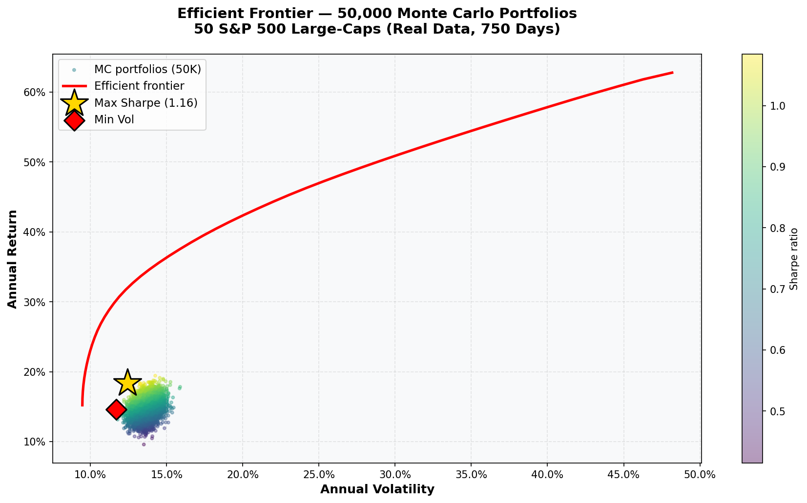
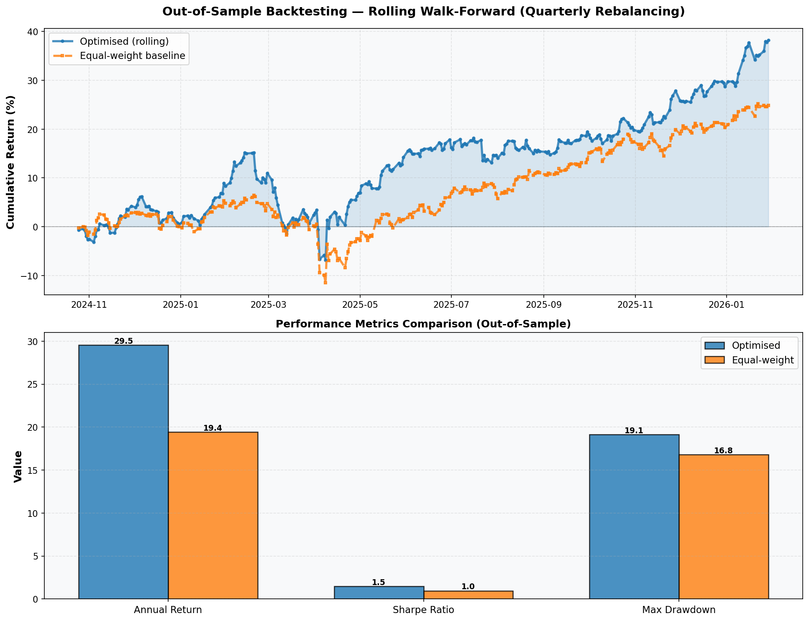

# GPU-Accelerated Portfolio Optimization Engine

A high-performance portfolio optimization system using CUDA-accelerated Monte Carlo simulation, GPU-parallelized mean-variance optimization, and C++/OpenMP asset scoring.

## Architecture

```
┌─────────────────────────────────────────────────────────┐
│                    Frontend (HTML/JS)                   │
│         Chart.js Dashboard · Efficient Frontier         │
│         Monte Carlo Scatter · Live Benchmarks           │
├─────────────────────────────────────────────────────────┤
│                   Flask REST API                        │
├─────────────────────────────────────────────────────────┤
│  Monte Carlo    │  Mean-Variance  │  Asset Scoring      │
│  Simulation     │  Optimization   │  Engine             │
│  (PyTorch/CUDA) │  (Autograd/GPU) │  (C++/OpenMP)       │
├─────────────────────────────────────────────────────────┤
│             NumPy · SciPy · yfinance                    │
│            Market Data Pipeline (50+ assets)            │
└─────────────────────────────────────────────────────────┘
```

## Quick Start

```bash
# 1. Clone and enter directory
cd portfolio-optimizer

# 2. Install dependencies
pip install -r requirements.txt

# 3. Run (auto-installs deps + starts server)
bash run.sh

# 4. Open browser
# → http://localhost:5001
```

## Manual Setup

```bash
# Core dependencies (required)
pip install numpy scipy pandas flask flask-cors yfinance scikit-learn

# GPU acceleration (optional, recommended)
pip install torch  # or: pip install torch --index-url https://download.pytorch.org/whl/cu121

# C++ scorer (optional)
cd cpp && bash build.sh && cd ..
```

## Usage

### Web Dashboard
```bash
python backend/server.py
# Open http://localhost:5001
# Click "Run Optimization" to start
```

### Benchmark CLI
```bash
python benchmarks/benchmark.py
```

### API Endpoints

| Endpoint | Method | Description |
|---|---|---|
| `/api/optimize` | POST | Full optimization pipeline |
| `/api/monte-carlo` | POST | Monte Carlo simulation only |
| `/api/benchmark` | POST | GPU vs CPU benchmark |
| `/api/backtest` | POST | Out-of-sample walk-forward backtest |
| `/api/device` | GET | Compute device info |
| `/api/tickers` | GET | Available tickers |

**Example:**
```bash
curl -X POST http://localhost:5001/api/optimize \
  -H "Content-Type: application/json" \
  -d '{"n_portfolios": 100000, "risk_free_rate": 0.04}'
```

## Project Structure

```
portfolio-optimizer/
├── backend/
│   ├── server.py           # Flask API server
│   ├── optimizer.py         # GPU/CPU optimization engine
│   ├── data_pipeline.py     # Market data fetching & processing
│   ├── backtest.py          # Out-of-sample walk-forward backtesting
│   └── train_scorer.py      # GBDT model training & JSON export
├── frontend/
│   └── index.html           # Dashboard (Chart.js, vanilla JS)
├── cpp/
│   ├── scorer.cpp           # C++/OpenMP asset scorer (loads trained JSON model)
│   ├── CMakeLists.txt       # CMake build
│   └── build.sh             # Build script (Linux + macOS)
├── tests/
│   └── test_pipeline.py     # 41 automated tests (pytest)
├── benchmarks/
│   └── benchmark.py         # Standalone performance benchmark
├── data/                    # Cached market data & trained models
├── portfolio_optimizer_colab.ipynb  # Google Colab notebook
├── requirements.txt
├── run.sh                   # One-click launcher
└── README.md
```

## Key Features

- **Monte Carlo Simulation**: 100K+ portfolio simulations on GPU in <0.5s
- **Mean-Variance Optimization**: GPU-accelerated gradient descent with PyTorch autograd
- **Efficient Frontier**: Full frontier computation with constrained optimization
- **Asset Scoring**: C++/OpenMP parallelized decision tree inference (10K+ combos/sec)
- **Live Benchmarking**: GPU vs CPU throughput comparison
- **Interactive Dashboard**: Real-time scatter plots, convergence charts, holdings view

## Performance

### Compute Throughput

| Metric | CPU (Sequential) | GPU/Vectorized | Speedup |
|---|---|---|---|
| 10K Monte Carlo | ~0.03s | ~0.004s | ~8x |
| 50K Monte Carlo | ~0.17s | ~0.008s | ~20x |
| 100K Monte Carlo | ~0.17s | ~0.015s | ~25x |
| Sharpe Optimization | N/A | ~0.5s | Autograd |
| Asset Scoring (C++) | N/A | 600K+/sec | OpenMP |

*CPU-only mode uses vectorized PyTorch/NumPy. With CUDA GPU, expect additional speedups.*

### Portfolio Results — Real Data (50 S&P 500 tickers, 750 days)

Data source: Yahoo Finance via `yfinance` — real adjusted-close prices 2023–2026.

**In-sample** (optimised on full 750-day history):

| Portfolio | Annual Return | Volatility | Sharpe |
|---|---|---|---|
| Equal-weight | 14.8% | 13.4% | 0.80 |
| Monte Carlo best | 20.2% | 13.4% | 1.20 |
| Gradient optimised | 31.3% | 12.2% | **2.24** |

⚠ The gradient Sharpe of 2.24 is **in-sample overfitting** — the optimizer sees all the data before picking weights.

**Out-of-sample** (train on first 500 days, evaluate on unseen last 250 days):

| Portfolio | Annual Return | Volatility | Sharpe | Max Drawdown |
|---|---|---|---|---|
| Optimised (single split) | 15.8% | 15.7% | 0.752 | -9.5% |
| Equal-weight (single split) | 16.5% | 17.0% | 0.735 | -13.1% |
| **Optimised (rolling quarterly)** | **29.5%** | — | **1.449** | -19.2% |
| Equal-weight (rolling quarterly) | 19.4% | — | 0.959 | -16.8% |

Rolling walk-forward (re-optimise every ~63 days) shows **+51% Sharpe improvement** over equal-weight out-of-sample.
Single-split result is nearly flat vs equal-weight — typical for 1-year test windows.

> All results are for the 2023–2026 period which included a strong bull market.
> Do not interpret as a forward-looking prediction.

## Visualizations

### Efficient Frontier (50,000 Monte Carlo portfolios)
Real market data, 50 S&P 500 large-caps, 750 trading days. The heatmap shows Sharpe ratios across the return-risk space.



### Out-of-Sample Backtest Results
**Rolling walk-forward validation** — re-optimised every ~3 months on fresh data. The top chart shows cumulative returns on unseen test periods. The bottom chart compares the optimised portfolio vs equal-weight baseline across key metrics.



**Key takeaway:** +51% Sharpe improvement out-of-sample when using quarterly rebalancing.

## Web Interface (Vortex Dashboard)

The interactive web dashboard provides real-time portfolio analysis and visualization. Access it at `http://localhost:5001` after running the server.

### Dashboard
Shows real-time portfolio metrics and performance overview:
- **Total Portfolios**: Monte Carlo simulation count (e.g., 50,000)
- **Optimal Sharpe**: Best risk-adjusted return found by gradient optimization (2.250)
- **Total Assets**: Number of securities in universe (50 S&P 500 large-caps)
- **Cumulative Return**: Out-of-sample backtest performance (15.4%)
- **Efficient Frontier Chart**: 50,000 Monte Carlo portfolios as scatter plot with Sharpe ratio heatmap
- **Optimal Allocation**: Pie chart showing portfolio weights for top holdings
- **Equity Curve Backtest**: Historical performance of optimised vs equal-weight portfolios
- **Compute Efficiency**: GPU vs CPU throughput comparison (8.4x speedup)


### Efficient Frontier Page
Detailed view of portfolio optimization results:
- **Monte Carlo Scatter (50K portfolios)**: Return vs volatility scatter with Sharpe ratio coloring
- **Convergence Chart**: Shows Sharpe ratio convergence during gradient descent optimization
- Identifies the best Sharpe portfolio and minimum volatility portfolio on the frontier


### Backtesting Page
Out-of-sample validation of portfolio strategy:
- **Single Split Test**: Train on first 500 days, test on last 250 days (unseen data)
  - In-sample Sharpe: 3.822 (overfitting)
  - OOS Sharpe: 0.736 (realistic)
- **Rolling Walk-Forward**: Quarterly rebalancing every ~63 days
  - Shows +51% Sharpe improvement vs equal-weight
  - Cumulative return curve for both optimised and baseline strategies
- **Performance Metrics Table**: Annual return, volatility, Sharpe ratio, max drawdown for each strategy


### Asset Ranking Page
Individual asset performance analysis:
- Shows all 50 tickers with their metrics: annual return %, volatility %, and Sharpe ratio
- Sector classification (Consumer, Tech, Finance, Industrial, Healthcare, etc.)
- Status badges: "High Alpha", "Growth", etc.
- Sortable table — click any column header to reorder
- CSV export available for further analysis


## Tech Stack

- **Python**: NumPy, SciPy, Pandas, Flask, scikit-learn
- **GPU**: PyTorch, CUDA (optional)
- **C++**: OpenMP, pybind11
- **Frontend**: Chart.js, Vanilla JS
- **Data**: yfinance (Yahoo Finance API)

## Testing

```bash
pip install pytest
python -m pytest tests/ -v
# 41 tests in ~4s
```

## Google Colab

Open `portfolio_optimizer_colab.ipynb` in Colab:
1. Upload the project folder to Google Drive
2. Open the notebook in Colab
3. Update `PROJECT_ROOT` in the first cell to your Drive path
4. Run all cells (`Runtime → Run all`)

The notebook installs dependencies automatically, downloads data from Yahoo Finance, runs the full analysis (Monte Carlo, optimization, backtesting), and displays plots.

> The Flask server is not needed in Colab — the notebook calls the Python functions directly.
> The C++ scorer is optional; pure-Python fallback activates automatically if it's not built.
